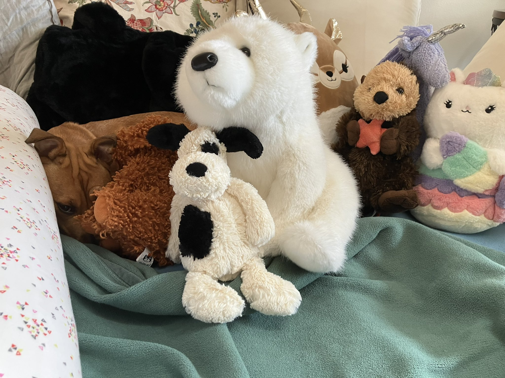
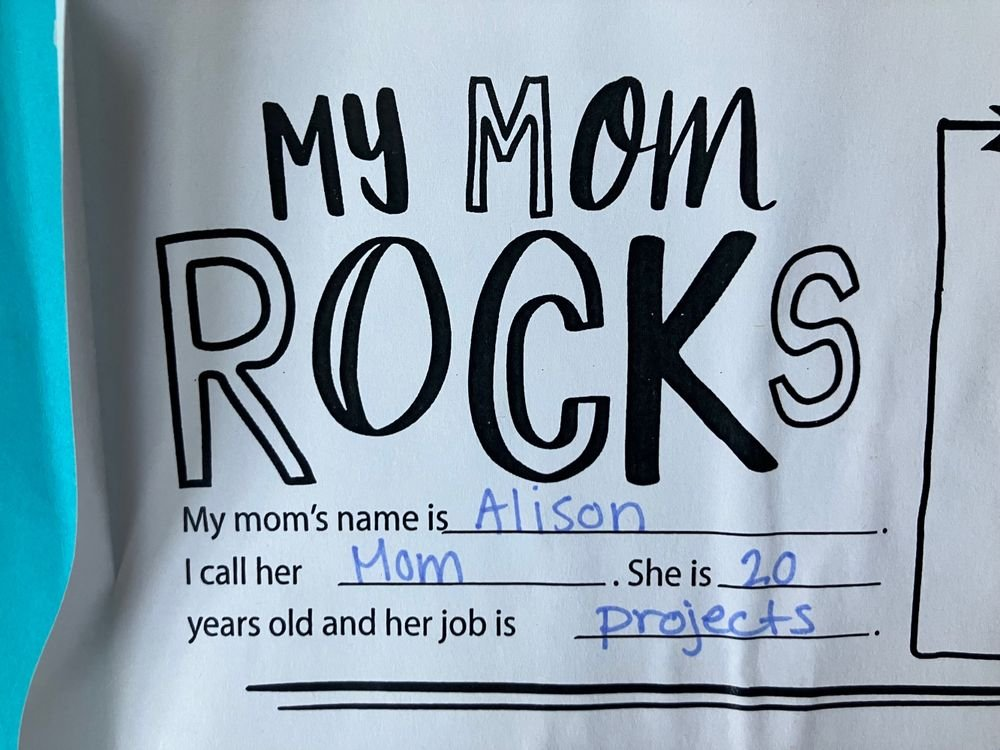
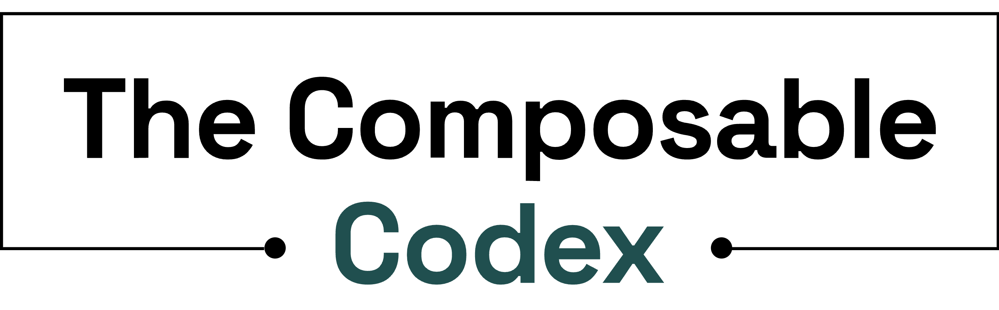

 [Still from Taylor Swift's Blank Space music
video](https://twitter.com/billboard/status/618449502287085568)

## Nice to meet you, where you been?

It has been a beat since I last blogged. What have I been up to? My last
post was April 4, 2022 and it was about Quarto, which is an open source
product that I was involved in the development of as the product manager
for data science communication at Posit nee RStudio.

Since then, I've been keeping myself busy (in no particular order):

1.  :teddy_bear: Raising my daughter (who is now 7,
    [Sharla](https://sharla.party/), if you are reading this :wink:)

2.  :muscle: Supporting family members whose bravery, strength, and
    resilience in the face of surgery, a gut-wrenching diagnosis, and
    months of treatment over the past two years continues to inspire and
    ground me

3.  :it: Living in [Bologna,
    Italy](https://en.wikipedia.org/wiki/Bologna) for half of
    2022 [I drank this art every morning thanks to
    Francesco at Bar Nuovo](https://www.instagram.com/barnuovobologna/)

    You can see me in my totally generic looking but still Italian
    coworking space in [this
    interview](https://www.youtube.com/watch?v=HZf5s_QWEpA) that I did
    with my
    [`palmerpenguins`](https://allisonhorst.github.io/palmerpenguins/)
    co-author [Allison Horst](https://allisonhorst.com/) and my fellow
    RStudio alum [Jesse
    Mostipak](https://www.linkedin.com/in/jessemostipak/).
    

4.  :package: Pulling off two inter-state moves (it never gets easier)

5.  :dog2: Rescuing and raising a street dog from Mexico
     [I love this
    dog](https://x.com/apreshill/status/1670885696423493632?s=20)

6.  :carousel_horse: Making big career moves: leaving IBM (where I was a
    senior data scientist and technical product manager on the AI
    Strategy & Innovation team with [Gabriela de
    Queiroz](https://k-roz.com/)) for a job at a startup (a software
    company called [Voltron Data](https://voltrondata.com/))

7.  :ice_skate: Re-discovering my love for ice skating. I used to ice
    skate as a kid, and with our latest move to Montana, I now have easy
    access to both indoor and outdoor rinks. I got my first pair of
    "white skates" in maybe 30 years, and I started volunteer teaching
    young kids to skate at our local rink.

8.  :woozy_face: Mourning the loss of a community that I loved being a
    digital part of while I watched us all desperately cling to our
    social identities across every new social media platform (spin up
    random accounts on
    `<insert new tool that we all just wish was old tech Twitter>`. My
    accounts now span across [Post News](https://post.news/@/apreshill),
    [Mastodon](https://fosstodon.org/@apreshill), LinkedIn, and Blue
    Sky, and I get very little value out of any single one now and I
    have stopped caring.

9.  :raised_hands: Reveling in taking online courses from other people
    instead of teaching them myself! Highlights include:

    -   A course on ["Cracking the Product
        Strategy"](https://maven.com/jackie-bavaro/cracking-the-product-strategy)
        by [Jackie Bavaro](https://www.linkedin.com/in/jackiebavaro/)

    -   One on [website content and
        conversion](https://maven.com/mkt1/website-conversion) (but
        really so much more about website organization, flow, and user
        experience) by [Emily
        Kramer](https://www.linkedin.com/in/emilykramer/) of
        [MKT1](https://www.mkt1.co/)

    -   An impromptu free workshop by [Brie
        Wolfson](https://www.briewolfson.com/) on writing a [personal
        press
        release](https://review.firstround.com/ditch-your-to-do-list-and-use-these-docs-to-make-more-impact#8-personal-press-release)

    -   A hand-on [SQL](https://t.co/kOXWhm6E3F) workshop by
        Observable's [Paul
        Buffa](https://www.linkedin.com/in/paul-buffa/)

10. :climbing_woman: Climbing my way back into creator mode, crafting a
    long-form series about designing and building [composable data
    systems](https://voltrondata.com/codex.html) (more on this below).

## I could show you incredible things

When I was in my roles at RStudio, it was easy (and almost expected) to
have a personal website (if you are new here, I am a co-author of the R
blogdown package and the book on the same package), be present on social
media, and just generally have a very public profile. That level of
community engagement was both energizing and exhausting for me. I could
make things, I could launch things, I could share things, I could make
real software work better for real people.

But when I decided that it was definitely [time to leave my job at
RStudio,](https://cate.blog/2021/11/29/5-signs-its-time-to-quit-your-job/)
I went through a lot of feelings of loss (a blog post for another time).
 [Three truths and a
lie](https://x.com/apreshill/status/1657780245230137344?s=20)

Namely, I lost that joy of creation. I was watching an episode of Home
recently and realized exactly what it was: the feeling of

## Magic, madness, heaven, sin: The Composable Codex

A couple of months ago, I finished a big project at work. It feels odd
writing this because so far in most of my career I've finished a few
biggies that I have not blogged about. Publishing books and papers,
getting big grants, keynoting conferences, launching websites,
developing software packages

 [Awesome logo from The Composable Codex, by Voltron
Data's design team](https://voltrondata.com/codex)

What is [The Composable Codex](https://voltrondata.com/codex) ? At I'm
lucky to work w/ experts leading the composable data systems movement
for years, but not everyone has this luxury. Even the experts don't have
time to educate holistically on this - so the experts talk to the other
experts and it all flies over everyone else's heads\...In one of my
favorite talks by Kathy Sierra, she said to do a thought experiment: add
\"world\" to whatever users do with your product. So that is The Codex!
The world of composable data systems, distilled to the key themes,
written by and for real humans to read and return to.

In terms of raw effort, The Codex took me almost exactly four months
from start to finish to write (July - November 2023), about the same
amount of time it took to complete [my
dissertation](https://ir.vanderbilt.edu/handle/1803/11826), write an
R01-funded grant, and develop
[tidymodels.org](https://www.tidymodels.org/) ([RIP to that Hugo
site](https://github.com/tidymodels/tidymodels.org-legacy)).

| **Chapter**                                                                                      | **Word count** |
|---------------------------------------------|---------------------------|
| [Chapter 00: A new frontier](https://voltrondata.com/codex/a-new-frontier)                       | 3989           |
| [Chapter 01: Standards over silos](https://voltrondata.com/codex/standards-over-silos)           | 4929           |
| [Chapter 02: Bridging language divides](https://voltrondata.com/codex/bridging-language-divides) | 5856           |
| [Chapter 03: Data sprawl](https://voltrondata.com/codex/data-sprawl)                             | 6468           |
| [Chapter 04: The Wall & The Machine](https://voltrondata.com/codex/wall-and-machine)             | 8744           |
| Total                                                                                            | 29,986         |

It was so big that I'm still working on processing all the emotions: joy
at people reading it and sharing it (thank you for every private DM +
public `<X?>`:heart:), relief that I'm back to "normal life" and a
9-to-5(\*ish) job, anxiety that people will not like it, but most of
all, excitement about what is next both for The Codex itself (plug to
[sign up for emails from me and my team](https://voltrondata.com/codex)
at the bottom of this page) and for my career. Stay tuned.
