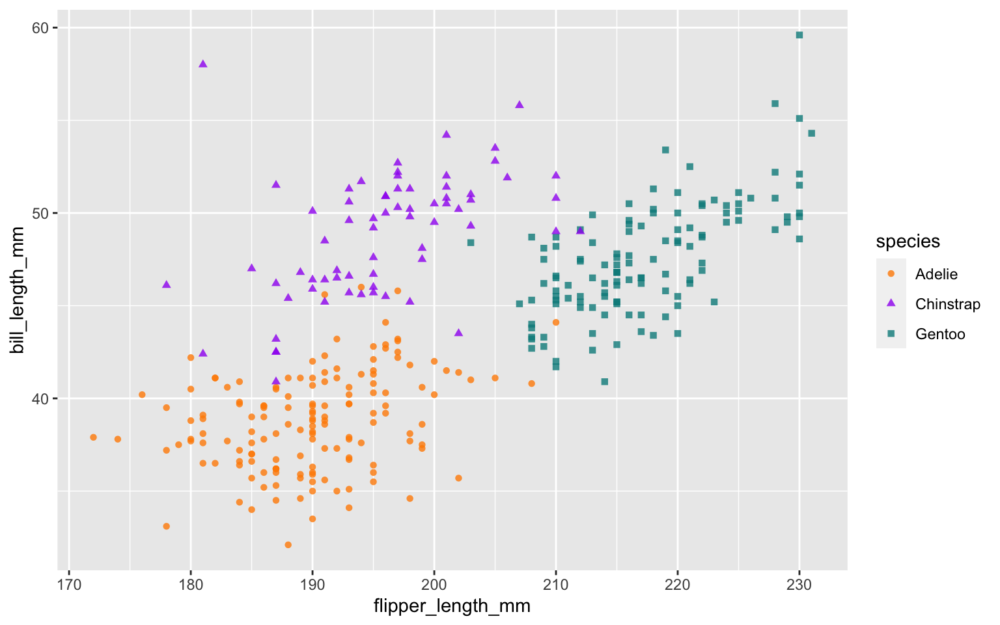

> *Thumbnail image from the [Official Disney Fan Club
> website](https://d23.com/why-everyone-is-talking-about-bruno-from-encanto/)*

## Background

Early last year, I was busily checking [Quarto](https://quarto.org/),
and totally terrified of checking Twitter. Seriously, I held my breath
every time. It. Was. Not. Ready. It was changing fast and breaking fast.
Everyday I was seeing the GitHub stars slowly creeping up, and I was
nervous. And we had all agreed on our team that *"We don't talk about
Quarto"* on the outside. That means not a single one of us were tweeting
or blogging about it, or even at that point trying to teach it to anyone
--- yet.

But, slowly things started easing up. By the time summer internship
positions at RStudio [were
announced](https://www.rstudio.com/blog/summer-internship-2021/), I was
excited to have reserved a slot for our first Quarto intern, who would
be tasked with working with myself, [JJ
Allaire](https://github.com/jjallaire), and [Charles
Teague](https://github.com/dragonstyle) to help get the Quarto docs off
the ground. We brought [Paul Villanueva](https://pommevilla.rbind.io/)
on in one of the best hiring decisions I've made, and he ended up doing
*so much more* than just docs! By August 2021, I had convinced Paul to
join me as a TA to teach the first public Quarto workshop for the
R/Medicine. And I honestly felt comfortable teaching Quarto then --- it
felt like it was time. Luckily, the Quarto team had stabilized releases
of Quarto in August before the workshop, and we were able to spin up a
custom RStudio Cloud environment to use a preview release of the RStudio
IDE, and we were off!

Fast forward to now, and [it looks like we are
talking](https://www.nature.com/articles/d41586-022-00563-z) about
Quarto. I am \>6 months from my time at RStudio and I am writing a book
with the amazing [Rich Iannone](https://github.com/rich-iannone) about
doing data science with R and Quarto, in a Quarto book, and I've built
an internal knowledge repository for my IBM team with Quarto (these are
not R or RStudio users!). So in this post, I thought I'd finally share
my notes to myself after testing and teaching Quarto, and now as a user
and enabler.


## What you'll need to know

-   Quarto is actually a separate installation.

    -   **What to do?** Follow [Step
        1](https://quarto.org/docs/get-started/) to download Quarto for
        your OS. I do this now regularly about once a week to make sure
        I'm getting the latest goodies.

    -   There is also an [R
        package](https://cran.r-project.org/web/packages/quarto/index.html),
        which will allow you to render at the command line if you aren't
        an RStudio IDE/button clicking person, but you could also use
        the command line, which is what I do.

-   Quarto works within the RStudio IDE.

    -   **What to do?** Download the latest RStudio IDE release from
        this link:
        <https://quarto.org/docs/get-started/hello/rstudio.html>

    -   It has actually worked inside the RStudio IDE for almost a year.
        It was previously supported only in the
        [dailies](https://dailies.rstudio.com/) (which are honestly
        low-risk to download and use!). But nowadays it works with the
        latest official released version of the RStudio IDE.

    -   It also works in [VSCode](https://code.visualstudio.com/); see
        **Step 2** [here](https://quarto.org/docs/get-started/).

-   The RStudio IDE's [Visual R Markdown
    Editor](https://rstudio.github.io/visual-markdown-editing/) was in
    actuality the first "shots fired" from Quarto.

    -   **Fun fact:** I forgot to tell our first Quarto intern, Paul,
        about the visual editor until about 4 weeks into his
        internship--- and it totally changed his outlook, even as an
        experienced Markdown user. So don't sleep on the [visual
        editor](https://quarto.org/docs/visual-editor/) when teaching
        and using Quarto. In particular, don't miss:

        -   [Easy editing/formatting of Markdown
            tables](https://quarto.org/docs/visual-editor/content.html#editing-tables)

        -   Copy/paste from Google docs (did you know this? Literally
            just copy any formatted text from Google docs and paste it
            into the visual editor)

        -   [Citations](https://quarto.org/docs/visual-editor/technical.html#citations)

        -   [The "insert anything" keyboard
            shortcut](https://quarto.org/docs/visual-editor/options.html#insert-anything)

        -   [Emojis
            🥰](https://quarto.org/docs/visual-editor/content.html#emojis)

## What you'll like

Across *all* formats:

-   Two column (and more) [flexible content
    layouts](https://quarto.org/docs/authoring/figures.html#complex-layouts)
    for displaying images, code, text, tables, plots, anything. This to
    me was the "one killer feature" when JJ first started showing me
    regular demos --- I was floored. While
    [**patchwork**](https://patchwork.data-imaginist.com/) can get you
    pretty far, this allows for literally anything (including just blank
    space) to be in any position, making it a layout swiss army knife.

-   [Global chunk
    options](https://quarto.org/docs/computations/execution-options.html)
    set in your YAML using the `execute` key (no more [**knitr** setup
    chunk](https://apreshill.github.io/rmd4cdc/#112)!). See all
    supported chunk options (that go beyond **knitr** ones)
    [here](https://quarto.org/docs/reference/cells/cells-knitr.html).

    <div class="cell">

    ``` yaml
    ---
    title: "We don't talk about Quarto"
    subtitle: "Until now!"
    execute:
      echo: false
    ---
    ```

    </div>

    Say goodbye to memorizing this dear friend:

<div class="cell">

```` markdown
```{r}
knitr::opts_chunk$set(echo = FALSE)
```
````

</div>

-   [Easier verbatim
    chunks](https://quarto.org/docs/computations/execution-options.html#fenced-echo)
    using `echo: fenced` as a code chunk option. For example, I am using
    this chunk option here (invisibly) to show a chunk where I am
    suppressing the results printing:

<div class="cell">

```` markdown
```{r}
#| results: hide
1 + 1
```
````

</div>

-   [Chunk
    options](https://quarto.org/docs/computations/r.html#chunk-options)
    as YAML with the special hashpipe `#|` (great for [longish alt
    text](https://www.rstudio.com/blog/knitr-fig-alt/)) (note that
    Quarto also added a way to [add alt
    text](https://quarto.org/docs/authoring/figures.html#alt-text) for
    Markdown inserted images, thanks to [Silvia
    Canelon](https://github.com/quarto-dev/quarto-web/issues/20))

    <div class="cell"
    fig-alt="Scatterplot of flipper length by bill length of 3 penguin species, where we show penguins with bigger flippers have bigger bills.">

    ```` markdown
    ```{r}
    #| fig-alt: "Scatterplot of flipper length by bill length of 3 penguin species, where we show penguins with bigger flippers have bigger bills."
    #| warning: false
    library(palmerpenguins)
    library(ggplot2)
    ggplot(data = penguins, aes(x = flipper_length_mm,
                                y = bill_length_mm,
                                color = species)) +
      geom_point(aes(shape = species), alpha = 0.8) +
      scale_color_manual(values = c("darkorange","purple","cyan4")) 
    ```
    ````

    <div class="cell-output-display">

    

    </div>

    </div>

-   Universal
    [cross-referencing](https://quarto.org/docs/authoring/cross-references.html)
    ([no more `bookdown::html_document2()`,
    etc.](https://pkgs.rstudio.com/bookdown/reference/index.html#single-document-output-formats))

-   [Parameters](https://quarto.org/docs/computations/parameters.html)
    (side note: here is the first **rmarkdown**
    [issue](https://github.com/rstudio/rmarkdown/issues/33) from 2014
    that [Tom Mock](https://themockup.blog/) and I found where the idea
    for parameters was "born" 👶)

And, if you are anything like me and your heart belongs to HTML
output...

-   SUBFOLDERS for projects (praise be). Yes you can have a website or
    book or any other multi-file Quarto project and render content in
    even deeply nested subdirectories. Rejoice! To put in your final
    product, let your heart decide- you can either list individually
    (similar to **bookdown**) or use [listing
    pages](https://quarto.org/docs/websites/website-listings.html) (like
    with **distill**).

-   Built-in site
    [search](https://quarto.org/docs/websites/website-navigation.html#site-search)
    (enabled by default for books and websites). Can also be
    [tweaked](https://quarto.org/docs/websites/website-search.html#search-appearance).

-   "Batteries included" HTML features across single documents and
    projects (like HTML books, websites, etc). This may be a RIP to the
    wonderful ["Pimp my Rmd"](https://holtzy.github.io/Pimp-my-rmd/).

    -   Here are just a few features that were available in some but not
        all R packages with `.Rmd` ▶️ HTML output formats: [code
        folding](https://quarto.org/docs/output-formats/html-code.html#folding-code),
        [copy/paste
        chunks](https://quarto.org/docs/output-formats/html-code.html#copy-button),
        [callout
        blocks](https://quarto.org/docs/authoring/callouts.html), [TOC
        on the
        side](https://quarto.org/docs/output-formats/html-basics.html#table-of-contents),
        [code
        linking](https://quarto.org/docs/output-formats/html-code.html#code-linking)
        via [downlit](https://downlit.r-lib.org/) (previously only
        available in [pkgdown](https://pkgdown.r-lib.org/)),
        [tabsets](https://quarto.org/docs/output-formats/html-basics.html#tabsets),
        [anchored
        headings](https://quarto.org/docs/output-formats/html-basics.html#anchor-sections)

-   [Show
    source](https://quarto.org/docs/output-formats/html-code.html#code-tools)
    to anyone viewing your HTML output (this was previously only
    possible with `rmarkdown::html_document()` - [my
    tweet](https://twitter.com/apreshill/status/1108925218850893832?lang=en)
    from when I first discovered this output option!)

-   Compatibility with
    [Hugo](https://gohugo.io/)/[blogdown](https://bookdown.org/yihui/blogdown/).
    This post is a `.qmd` file with `format: hugo` [rendered with
    Quarto](https://quarto.org/docs/output-formats/hugo.html).

    ``` yaml
    ---
    title: "We don't talk about Quarto"
    subtitle: "Until now!"
    format: hugo
    ---
    ```

    There is nothing stopping you from using Quarto to render individual
    posts, then blogdown to use Hugo, or just use Hugo from command
    line. The Hugo-specific flavor of Markdown
    ([goldmark](https://gohugo.io/getting-started/configuration-markup))
    is also [supported by the visual
    editor](https://rstudio.github.io/visual-markdown-editing/markdown.html#hugo-markdown).

## What you'll stumble on

-   Chunk options as YAML

    -   I always forgot the symbol, which is `#|` (read: the hashpipe).
        If you also cannot remember this, channel your 90s kid and enjoy
        this Weezer flashback:

    ```
    
    ```

    -   No equal sign, use a colon instead (i.e., `comment: ''`)

    -   If the value is `true`/`false`, use lower case! (no more
        screaming!) 😱 So `echo: false`.

-   To render to a specific format, use the `format` YAML key (instead
    of `output`)[^1]

-   Use `kebab-case` for all YAML keys *and* to delimit
    figure/layout/code chunk options instead of ... what we had before.
    This will be confusing at first because your **knitr** chunk options
    won't match the package documentation. See
    [here](https://github.com/quarto-dev/quarto-cli/pull/83) for the
    change (Quarto will auto-convert `fig.alt` for example to `fig-alt`,
    but still, you or someone you teach might be confused by this).

-   You'll be rendering as your verb, not knitting, but you'll still be
    using the **knitr** package as your
    [engine](https://quarto.org/docs/tools/rstudio.html#knitr-engine) if
    you want to use R instead of Python code chunks.

    -   This also means to watch **knitr** for news! [Follow releases
        carefully](https://github.com/yihui/knitr/releases)--- they will
        still matter.

-   For projects like books, websites, blogs, `quarto render` vs
    `quarto preview`. See docs
    [here](https://quarto.org/docs/websites/#workflow).

## What you'll miss (for now)

-   Defining your own format.

-   Making and bundling templates that are easily shareable.

-   Xaringan and remark.js for slides. This particular package and
    flavor of markdown was [never supported in the visual
    editor](https://github.com/yihui/xaringan/issues/300) because it is
    not a Pandoc-defined output format (the visual editor is specific to
    Pandoc-flavored markdown). So for HTML slides in Quarto,
    [reveal.js](https://quarto.org/docs/reference/formats/presentations/revealjs.html)
    is where it is at. I had a [post](/blog/2021-07-revealing-research/)
    about doing that research too (actually all my testing at that time
    was in Quarto!).

## What you (probably) won't miss

All the packages, each one working *slightly* different than the ones
you had already used. Essentially your experience trying to figure out
to work the shower everytime you go to a new hotel, but for each package
in the R Markdown ecosystem:

```

```

If you are on my blog, you are probably an R Markdown lover. As well you
should be. As am I. But who among us has not chased their own tail for
hours trying to figure out why one YAML key works over *here* but not
over *there*. Or perhaps you simply lacked the wherewithall to branch
out into the various extension packages because you sensed a rabbit hole
ahead. Or maybe you were a person who filed or upvoted GitHub issues
begging RStudio folks to just give you tabsets for
[every](https://github.com/rstudio/distill/issues/11)
[single](https://github.com/rstudio/blogdown/issues/429)
[html-based](https://github.com/rstudio/blogdown/issues/69)
[output](https://github.com/rstudio/bookdown/issues/1219)
[format](https://github.com/rstudio/blogdown/issues/175). You probably
will not miss this.

[^1]: This one screwed me up so bad, I actually tried to go back to
    **rmarkdown** at one point and couldn't figure out why I couldn't
    knit to `output_format: html_document` 🤦🏻
