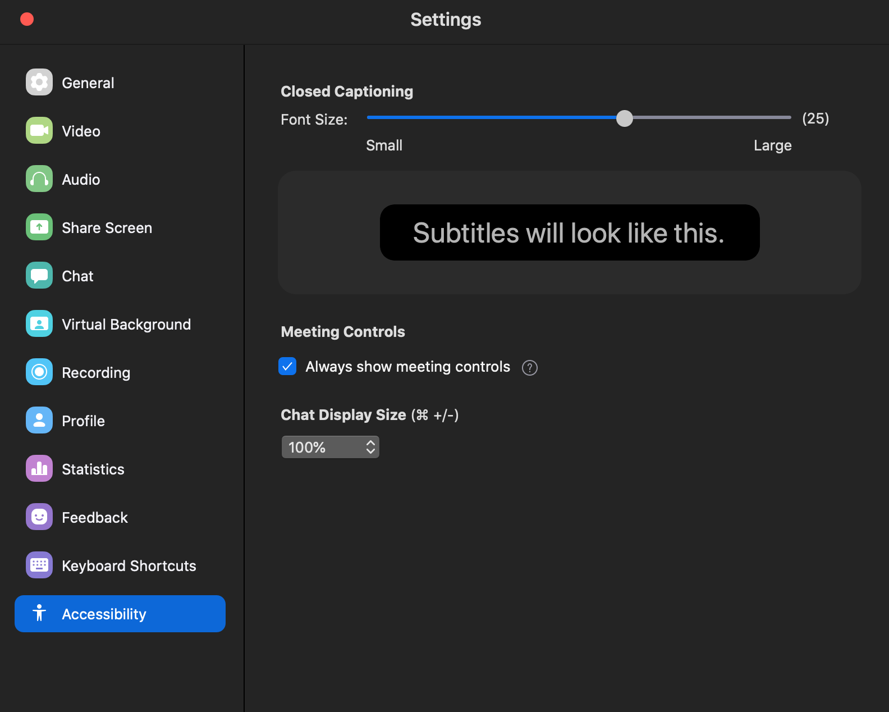

A few weeks ago, I wrapped up teaching [tidymodels](https://www.tidymodels.org) for the third time. We say third time's the charm, right? Even during a global pandemic? I don't know, but this time around was fun in new ways and hard in new ways, so I wanted to take the time to write some thoughts down about how it went.

## But why?

Why teach tidymodels virtually? I've already taught it as a [2-day workshop](/project/tidyml) at rstudio::conf(2020). I had already agreed to teach intro to machine learning with tidymodels as a full-day workshop for the Cascadia R Conf (which unfortunately was cancelled due to COVID), and the [R / Medicine conference](/talk/2020-rmedicine-tidyml/) (still on, and 100% virtual!).

I had three main goals: 

+ First, I wanted to do a good job for the R / Medicine conference workshop in August. This seemed like an interesting teaching challenge. One of the best compliments I've ever gotten from a colleague is that I "teach with heart" &mdash; so the challenge was, can a virtual workshop have a :heart:?

+ Second, given current events, I saw an opportunity to document a good system (tooling + pedagogy + logistics) around virtual workshops. I don't see them going away anytime soon. My colleague, [Greg Wilson](https://third-bit.com/), had also been giving our [RStudio certified instructor](https://education.rstudio.com/trainers/) [workshops virtually](https://drive.google.com/drive/folders/13ohFt3D0EJ5PDbMaWTxnHH-hwA7G0IvY) for over a year, so I trusted that he could help me navigate.

+ Third, help out the R / Medicine conference organizers. My partner-in-crime for this particular workshop, [Dr. Stephan Kadauke](https://education.rstudio.com/trainers/people/kadauke+stephan/), wanted to join me for some reconnaissance work. He is one of the conference organizers and will be leading his own workshop there, so he wanted to test out the tooling and the pedagogy too. 

So we thought, three birds, one stone: I get to pilot a much shorter version of my conf workshop materials, we get to test doing it virtually, and the R / Medicine conference organizers learn how this could all work in August.  

## How we planned it

Starting out, I knew I had two main hurdles:

+ Shaving two days of workshop content into `X` days
+ Logistics (like figuring out what `X` should be!)

The first decision based on conversations with Greg was to offer the workshop across two half-days. This is how the RStudio instructor training is timed, and it works well because there are few people who can (or want to) be tied up for a full day, especially if under stay-at-home orders. We asked Stephan if his group at the [Children's Hospital of Philadelphia (CHOP)](https://www.chop.edu/) would be up for two 4-hour sessions. Stephan's feedback was yes, but given that these folks at CHOP typically have weekly schedules, having two consecutive days would not work. So we opted for:

+ Two 4-hour sessions that were... 
+ exactly one week apart. 

I'm in Oregon, they were in Philly, so we decided to start at 9am my time (1pm for them) and wrap up at 1pm my time (5pm for them). After making this call, and again with Greg's sage advice to [take a break every hour](https://education.rstudio.com/blog/2020/03/teaching-online-on-short-notice/), I started working on a rough schedule. I had about 8 hours total to work with; about half of my conf workshop. We decided on:

+ 50 minute chunks, and
+ 10 minute breaks at 10 till the hour every single hour. 

I didn't try to make sure my materials for each session filled exactly 50 minutes. Instead, I promised the group that I would break wherever I was at the same time, and after each break we just picked up where left off. 

Here was the new topic outline:

### Day 1

1. [Session 00:](https://tmv.netlify.app/slides/00-intro) Intro (include a tooling tour- orient to Google doc + Zoom)
1. [Session 01:](https://tmv.netlify.app/slides/01-model) Build a model (mainly parsnip package)
1. [Session 02:](https://tmv.netlify.app/slides/02-resample) Resample a model (add rsample package, plus tune package for `fit_resamples()`)
1. [Session 03:](https://tmv.netlify.app/slides/03-recipes) Build a better training set (add recipes and workflows packages)

### Day 2

1. [Session 04:](https://tmv.netlify.app/slides/04-ensemble) Build an ensemble model (back to parsnip, now with model arguments)
1. [Session 05:](https://tmv.netlify.app/slides/05-tune) Tune a model (heavy tune package)
1. [Session 06:](https://tmv.netlify.app/slides/06-case-study) The Great Model-Off (a Kaggle-like group activity)

The final decision was about tooling. Luckily, Greg had advice here too. We went with:

+ Google doc as the "home page" + chat (no workshop website!)
+ RStudio Cloud for all exercises
+ Zoom for video 

## Pre-workshop launch list

+ Make shared Google doc and prepopulate with: Zoom link, RStudio Cloud link, bulleted list of participant names (be sure to make this *editable* for anyone!)
+ Email everyone with a Google calendar invite that includes the Zoom link and a link to a shared Google doc (be sure to make this *editable* for anyone!)
+ Ask everyone to fill in their 2-sentence bios ahead of time to ensure that you've done this correctly! 

The Zoom link and the Google doc link should be the **only** links that attendees see ahead of time. Then, the Google doc is the one true source for everything. Too many links at first leads to confusion later. I also prepopulated the doc with my session outline with HTML links to each session's slide deck. 

## Actual launch

In Zoom, I set it up to [mute everyone](https://support.zoom.us/hc/en-us/articles/203435537-Mute-All-And-Unmute-All) as they joined. We started with an [orientation](https://tmv.netlify.app/slides/00-intro) of the tools, the schedule, and the general plan for how they would work and interact with each other. We tried to keep questions per session in the Google doc, which my TA Stephan fielded in real time, which now is a great resource for me as I prepare for this again in August.

What I should have done: 

+ Have a Code of Conduct. I will next time. We didn't have any issues, but what came up later was that I asked participants to turn on their cameras. I wished that part of my Code of Conduct was that we would not videotape or take screenshots at any point to protect the privacy of all participants. 
+ Asked folks to make sure they had an updated version of Zoom. In particular, some newer security issues have been addressed recently, so this is nice for everyone to take advantage of. Plus the interface looked different for some.
+ Locked down the Zoom room. After a few minutes of starting, it was super distracting to have late arrivals who kept sending me personal chats asking for the links. 
+ In addition to locking down after the first 10-15 minutes, I also should have assigned my TA as a [co-host](https://support.zoom.us/hc/en-us/articles/206330935-Enabling-and-adding-a-co-host), so that he could have helped me manage that. We did this on day 2 and it worked great.

## How did it go?

So, I'm not going to lie here. The first session of teaching spooked me a bit. This was because all attendees left their videos off and I felt like:

It was eerie to teach to a silent void. On day 2, I asked for two volunteers to turn on their cameras for a single 50 minute block each because it really helped me to see faces. Participants probably kept their own view as "speaker only", but for me it really helped to be able to have some human feedback, even if they were muted. Much love to the head nodders out there. This conversation on day 2 broke my heart though, because several participants indicated they felt they couldn't turn on their cameras because they had young children at home. It is **hard**.

Interestingly, the participants didn't sense my discomfort at all. In fact, I heard from several that it was nice to see me up close and so personal. It actually felt *more personal* than a large in-person workshop, to my surprise.

On day 1, I started by asking participants to use Zoom reactions (like thumbs up) to answer questions, give me progress updates, etc. I ended up retiring this- it was distracting and the reactions disappear so it wasn't actually useful. Instead, I asked people to use the Zoom chat to indicate "done" or give quick one-word answers (a or b, yes or no).

Stephan also had a great idea for the breaks. On day 2, I started using Garrick Aden-Buie's [countdown app](https://pkg.garrickadenbuie.com/countdown/#29) to show the 10 minute break countdown full-screen. I used the hosted version [here](https://apps.garrickadenbuie.com/countdown/).

## What can I do better?

Logistically, I got really frustrated because I kept losing my Zoom meeting controls. Later I found out about this accessibility setting, which would have helped!

More substantively, as I mentioned, I would have a Code of Conduct at the very beginning. I also think virtual workshops offer a unique opportunity to include some more creative exercise types. Here are a few I brainstormed with Greg Wilson after the fact&mdash;expect to see these at R / Medicine if you attend with me!

+ Spot the bug- do in groups

+ Unscramble code

+ Predict what is going to happen

+ Fill in the blank with the [flair package](https://education.rstudio.com/blog/2020/05/flair/#example-3--mask-code-for-easy-practice-activities)

## Verdict

Transitioning from primarily teaching in person to teaching virtually is *hard*, and I'm in awe of [all the instructors](https://education.rstudio.com/blog/2020/05/remote-roundup/) I know who have had to do this on very short notice. But, can it be done with heart? Yes, I think so :heart:

## Thanks

Thanks to the participants, who were the loveliest guinea pigs. It is a hard time to learn and a hard time to find time. I appreciate that you took time out of your lives to spend 8 hours with me.

Thanks also to [Greg Wilson](https://third-bit.com/) for his support, and [Stephan Kadauke](https://www.chop.edu/doctors/kadauke-stephan) for being an awesome co-pilot. Extra special thanks to [Desirée De Leon](https://desiree.rbind.io/), who has the biggest heart of all. Knowing that I didn't have time for creativity with my slides, she surprised me with the most beautiful xaringan slide deck theme based on [tidymodels.org](https://www.tidymodels.org/). I merged in her PR *with glee and delight*, I know the participants felt those same emotions too (while learning about machine learning, no less!) :blossom:



## Feedback

If you are curious, here is some of the feedback I collected at the bottom of our Google doc:

### Two half days?
- worked well for me. A full day would be tough.
- Worked well for me also and I also think having all in one day would be a lot.
- worked well. 
- worked well for me too.

### Separated by one week?
- seemed fine.
- I liked this!
- good. Enough time to digest the previous session
- yes.

### Pace: too fast, too slow?
- good pace
- I liked the pace. It felt like we covered a lot of ground quickly, but also like we have great resources to come back to for refreshing on what we learned.
- good pace, except at “data leakage”. I still have hard time to understand that part.
- good pace.

### Scope: too small, too big?
- nice scope
- Nice scope
- very nice and practical.
- nice scope.

### Timing in 50 min chunks: too many or too few breaks?
- The 50 min chunks were great! I thought perfect length.
- Perfect break up. And the 10 min breaks gave enough time to make tea, grab a snack, etc.
- I am fine with that.
- works well.

### Timed code exercises: too easy, too hard?
- good
- Neither, I thought they were appropriate
- good. 
- good.

### In-between homework/reading?
- maybe some light reading or practice 
- In theory I think I would have liked some ‘homework’, but the week turned out to be so busy that I don’t know if I would’ve made time to complete it before the workshop.
- will be helpful to give some reading about different model descriptions in-between. 

### Final take-home project (+/- feedback)?
- optional
- I think this could be fun if we had access to a few different datasets to choose from. With maybe some pointers on what to look out for as we explore the data. Is it unbalanced? Could any two variables be collinear? Etc.
- i would vote for take-home project to play with.

### Zoom: video on/off?
- I find video distracting while working/listening/learning.
- I like being able to see the presenter/speaker’s video. I tend to choose “Speaker View” so that I don’t see all the participant videos (which I would find distracting).
- i am fine with either. I know, from the speaker’s perspective, it will be good to have video on. 
- I think it was nice and respectful to ask volunteers to turn video on part time! (Kudos to Stephan for having it on the whole time!)

### Google doc as our “home page” and “discussion forum”?
- Great!
- Yes! I thought it was a really helpful tool and ‘homebase’ to come to for all of the things (slides, R Studio Cloud project, etc.)
- very good! Much easier to track.
- works!

### Rstudio.cloud?

- pretty good except for crashing at end.
- ditto.
- I really enjoyed using R Studio Cloud. It makes it easier when I don’t have to worry about pre-installing packages or updating my version of R in order to go into a workshop. Having everything already set up for you in there is super convenient.
- I like Rstudio cloud generally. Just not suitable for complicated model training.
