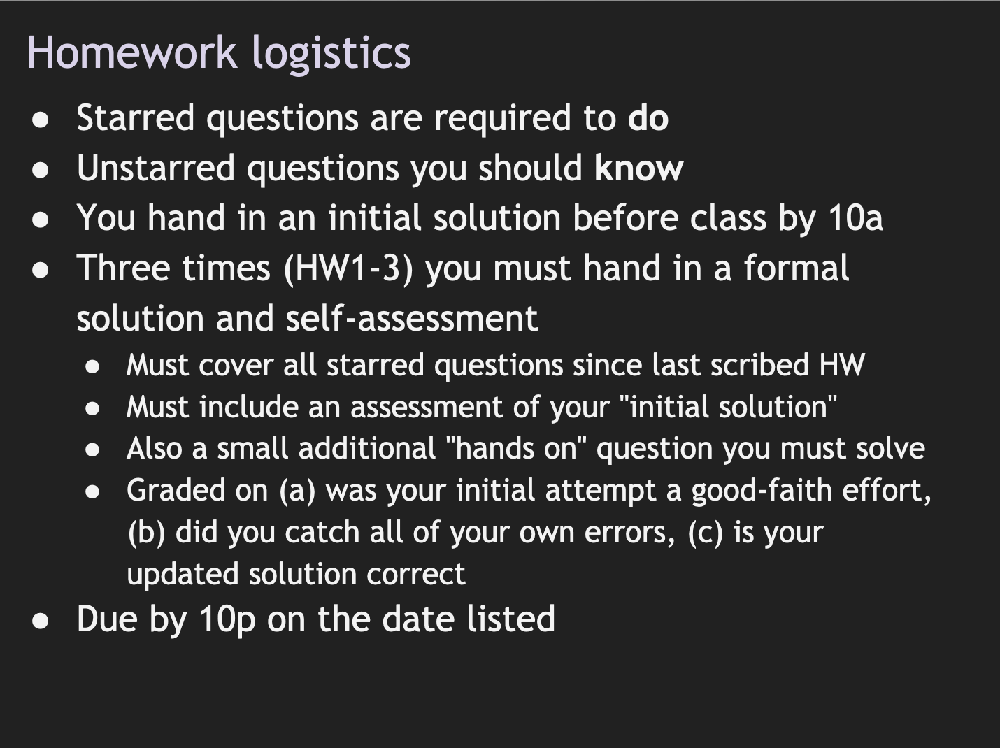

Last summer (`r emo::ji("grimace")`), I was invited to give a talk at the Joint Statistical Meetings on data science education. I immediately knew what I wanted to talk about! 

One of the things I spent a lot of time thinking about in my 8 years as a professor was grading. Truth be told, grading was my absolute least favorite part of teaching in academia. So, how did I 


I made beautiful answer keys for my homework assignments . . .

--

That no one read . . .

--

Maybe the best students did . . .

--

But that meant the ones who needed to read them the most . . .

--

did not.


Year after year, I twisted myself into pretzels trying to figure out a way to make a grading rubric that felt fair to me, and year after year I was dissatisfied. Why grade at all?, some people who think they are being helpful suggest. Why not just adopt a holistic, qualitative grading scheme?, others who might say. Yea, one quarter early in my career, I tried to be the "cool professor" who said "relax, your learning matters- your grade will reflect that" and gave out basically thumbs up / thumbs down on homework assignments. This came back to bite me hard when grades were due because at some point, if we were really honest with ourselves, all those holistic qualitative grading schemes do eventually translate into numbers. And I ended up with a masters student mutiny on my hands.^[To be clear, qualitative grading may be fine for some programs, and seemed to be acceptable to Ph.D. students (who did't really care about grades in my experience), but was not OK for masters students.]

With the help of student and TA feedback that year, I went back to the drawing board. I realized that *my* students needed grades. My students tended to be:

+ adult learners,
+ returning to school after their first career, and
+ holding down part- or full-time jobs while studying.

This meant my students were back in a university class after sometimes a >10 year gap, and they were juggling school with jobs, family, and kids. They needed grades to help reduce anxiety and prioritize time. I realized that in all the time I'd been teaching, I hadn't really spent too much thought thinking about how my own grading could *help serve my learners*. And it is about more than feedback- it was important to them that feedback -> numbers. They wanted to know how they were doing, and grades are typically a good way to gauge this!

In the mode of trying to find a solution, I happened to stumble upon a syllabus by [Hal Daumé](https://docs.google.com/presentation/d/1AL4WIGN6ti3uuIE-XgMQqQpLXijlVIeskI_D5ZxN80Q/edit#slide=id.g10749fb5e7_0_60) from his machine learning class. I noticed something intriguing in there called "self-assessments."

```{r daume, fig.cap="From Hal Daumé's syllabus", echo=FALSE, out.width="75%"}

```

This slide was all I could find out about it, but I was all in already on the idea. Having a Ph.D. in [developmental psychology](https://en.wikipedia.org/wiki/Developmental_psychology), I'd spent a lot of time studying the literature on the science of learning, and the idea of a self-assessment immediately made me think:


Why might this actually work? It reinforces some tried and true self-directed learning strategies that are actually evidence-based like:

- retrieval practice!
- distributed practice!
- elaborative interrogation!
- self-explanation!

I won't bore with *all the edu literature*, but if you want to know more you might enjoy reading:

- http://www.indiana.edu/~pcl/rgoldsto/courses/dunloskyimprovinglearning.pdf
- http://tguilfoyle.cmswiki.wikispaces.net/file/view/What_works,_What_doesn%27t.pdf
+ https://www.apa.org/science/about/psa/2016/06/learning-memory

So I tried it! It went so well on the first round. Every quarter I taught, I honed my system even more. Here is my version of Hal's slide:

```{r key, fig.cap="Self-assessment plan", echo=FALSE}
knitr::include_graphics("key.png")
```

The truth is, providing the answer keys or feedback at the end is not actually
helpful for learners. Students have high motivation and set aside time for what matters for their grade, not necessarily their learning. So it's no surprise that motivation was low and time was limited for students
to devote to "extracurricular" learning.

## How to succeed while really trying

### Submit a perfectly accurate initial solution.

> "I found the same results as the answer key. Bada bing, bada boom."

### Submit a perfectly accurate self-assessment.

Given an initial "good faith" effort.

> "Well, well, well. I was really confused about interaction effects."

> "Gah! I didn't actually understand the null hypothesis here."

> "I forgot to set a seed for my permutation test, so now I see why my results kept changing!" 

## What I read

> "Most of my code matches the answer key - there were only one or two sections where I didn’t make the correct plot or write the correct code for the desired output, but I think a good portion of my narrative was accurate, which is encouraging."

> "After doing this self-assessment, I’m realizing that I had a better grasp on this analysis than I had previously thought. I made a couple small errors, but after seeing the answer key, I think I understood why I made them and how to avoid those errors in the future. "

> "I liked that the self-assessment allowed me to see where I was close and what parts I was really far off."

> "I found that, while generating this model was straightforward, interpretation of the results was more difficult than I expected."

```{r jsm, fig.cap="L to R: Shannon Ellis, Stephanie Hicks, Michael Love, me", echo=FALSE, out.width="75%"}
knitr::include_graphics("jsm2019.jpg")
```


mention andragogy

```{r include = FALSE}
library(xaringanExtra)
xaringanExtra::use_share_again()
xaringanExtra::style_share_again(
  share_buttons = c("twitter", "linkedin", "pocket")
)
```

```{r echo=FALSE}
xaringanExtra::embed_xaringan(url = "https://alison.netlify.app/jsm-talk-ds/#1")
```

- Elaborative interrogation

- Self-explanation


    


Logistics:

If knitted PDFs, do self-evaluation in different colors: 

`Roses are \textcolor{red}{red}, violets are \textcolor{blue}{blue}.`

renders: Roses are \textcolor{red}{red}, violets are \textcolor{blue}{blue}.

Roses are <span style="color:red">red</span>, 
violets are <span style="color:blue">blue</span>.

# Homework

A total of 4 homeworks will be assigned; your lowest score will be dropped at the end of the quarter. Some homeworks will require you to use R to analyze data. Although no prior R experience is required for this course, be prepared to do *a lot* of self-guided learning. Students are expected to run R on their own computer or a computer they have plenty of access to and control over. Please attempt to do all homeworks on your own, but you may work with other students. However, you may not submit homework assignments as a group. You should submit your own original work. Please bear in mind that when a homework involves R, you will lose points for any of the following:

* Printing entire dataframes in the R Markdown file
* Code with no comments
* Code which produces an error message

You will have 1 week to complete each homework assignment, and your initial solutions must be submitted to Sakai by 2pm on the due date (at the start of class on Thursdays). Late homeworks will not be accepted. 

## Homework self-assessment

After the initial solutions are due, you will be provided a solution key. Using that key, you will be asked to assess your own initial solutions for accuracy and thoroughness; where you made mistakes, you must discuss and analyze where you went wrong, and correct them without copying/pasting directly from the key (this typically means that you need to include more narrative than we provide in the key). A good self-assessment will include:

- Assessment of the accuracy and completeness of your "initial solutions"
- Correct worked solutions with some discussion and analysis of why your initial solution was incorrect, and reflection on the source of your confusion (if you got an answer correct, this is not necessary)
- Attributions as appropriate to other students who helped you, or other sources such as lecture notes, readings, online resources, etc. that helped you 

## Homework grades

Homework grades will be based on:

- Was your initial solution a good faith effort?
- Did you catch all of your own errors in your self-assessment?
- Is your updated solution correct?

Each homework includes 3 questions, worth 5 points per question, scored as follows:

2 points for each initial solution being “in-good-faith”.

- 2 (Strong attempt): answer reflects strong independent problem solving, with clearly thought out attempts to approach the problem and a diligent and honest effort to find the solution

- 1 (Weak attempt): answer reflects some attempt to approach the problem, but approach appears to be superficial and lacks depth of analysis 

- 0 (No attempt)
    

3 points for the quality of the final answer / discussion.

- 3 (Exceptional): answer is thorough, concise, and clearly demonstrates ability to analyze and interpret statistics as well as theoretical understanding of statistical concepts

- 2 (Adequate): answer addresses the question with moderate inaccuracies in analysis and/or interpretation, or offers a correct but incomplete answer

- 1 (Inadequate): answer attempts to address question with substantial inaccuracies in analysis and/or interpretation

- 0 (Insufficient): answer does not attempt to address question or answer is insufficient to grade
    
This means that:

* You can get 100% of the points if you either:
    - Submit perfectly accurate initial solutions, or
    - Submit a perfectly accurate self-assessment, 
* If you simply cannot submit any homework solutions on time, after the homework due date, you will receive the solutions key and can submit a self-assessment for a max score of 60% (3 out of 5 points per problem). We feel this is fair given that:
    - You did not attempt a good faith effort, and 
    - We will drop your lowest homework grade. 

## What is a "good faith effort"?

Simply submitting nonsense or saying “I can’t do this” for each problem will not meet our criteria for a good faith effort, because there is no attempt on your part to show us why you are struggling, what you tried but didn’t work, what specific part of the problem you got stuck on, which other examples in the text/lecture you tried to work through to get a grasp on the problem, etc. ^[This is especially true if you don’t attend any office hours, post on Sakai, or otherwise seek out help *before* the due date.] The good faith effort is just that- we are interested in seeing evidence of a diligent and honest effort on your part, made with deliberate intention, to understand the problem and attempt an answer.