```{r setup, include=FALSE}
options(htmltools.dir.version = FALSE)
knitr::opts_chunk$set(tidy = FALSE, eval = FALSE)
```

class: inverse, center, middle

# Keep in touch

<a href="mailto:apresstats@gmail.com"><i class="fa fa-paper-plane fa-fw"></i>&nbsp; apresstats@gmail.com</a><br>
<a href="https://apreshill.rbind.io"><i class="fa fa-link fa-fw"></i>&nbsp; apreshill.rbind.io</a><br>
<a href="http://twitter.com/apreshill"><i class="fa fa-twitter fa-fw"></i>&nbsp; @apreshill</a><br>
<a href="http://github.com/apreshill"><i class="fa fa-github fa-fw"></i>&nbsp; @apreshill</a><br>
<a href="http://cslu.ohsu.edu"><i class="fa fa-map-marker fa-fw"></i>&nbsp; OHSU Center for Spoken Language Understanding</a>

---

class: inverse, center, middle

<iframe src="https://giphy.com/embed/jWRGIOH6dDZXG" width="480" height="360" frameBorder="0" class="giphy-embed" allowFullScreen></iframe><p><a href="https://giphy.com/gifs/jWRGIOH6dDZXG"></a></p>

---

class: center

# blogdown

--

## An R package for creating websites using R Markdown and Hugo

--

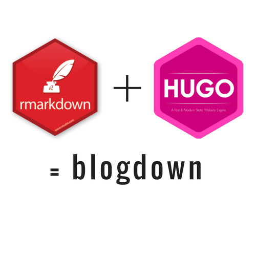

---

class: center

# You don't have to blog to use blogdown

https://yihui.name/en/2017/06/netlify-instead-of-github-pages/


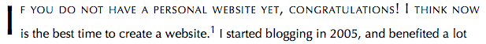

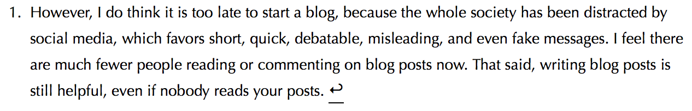

---

class: inverse, center, middle

# How to do this workshop

## Just watch

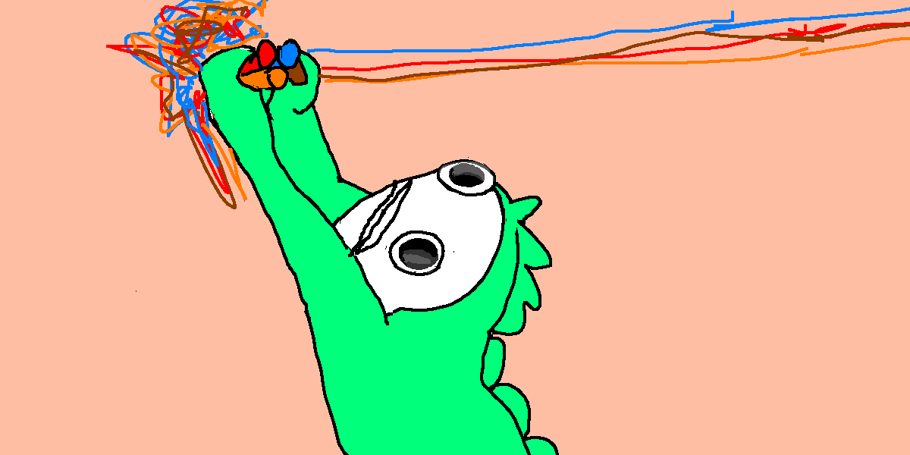
http://hyperboleandahalf.blogspot.com

---

class: inverse, center, middle

# How to do this workshop

## Do it with me

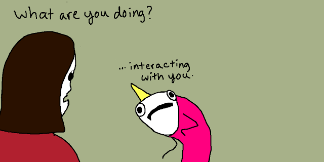
http://hyperboleandahalf.blogspot.com

---

class: inverse, center, middle

# Do the workshop with me

Download the workshop bundle materials from my github repo: https://github.com/apreshill/blogdown-workshop

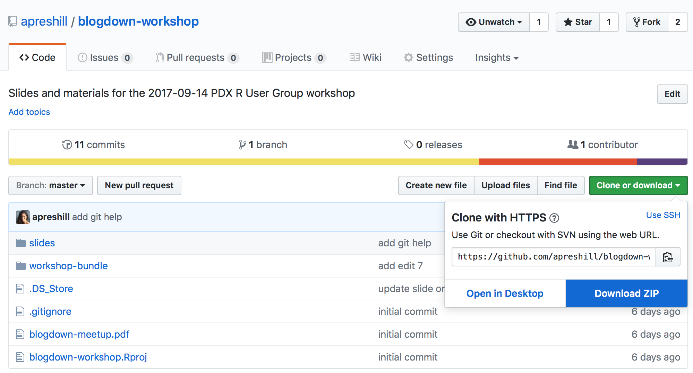

---

class: inverse, center, middle

# Get Started

---

# Install **blogdown**

`blogdown` was released on CRAN this week!

```{r}
install.packages("blogdown")
```

--

Or use the development version:

```{r}
if (!requireNamespace("devtools")) install.packages("devtools")
devtools::install_github("rstudio/blogdown")
```


---

# Install Hugo using **blogdown**

```{r}
blogdown::install_hugo()
# or
library(blogdown)
install_hugo()
```

--

Other relevant functions:

```{r}
blogdown::update_hugo() # force an update
blogdown::hugo_version() # check version
```


---

class: inverse, center, middle

# Make a site

---

# Create a new R Project

You are recommended to use the [RStudio IDE](https://www.rstudio.com/products/rstudio/), but you do not have to.

- Create a new R Project from the menu `File -> New Project -> New Directory`

---

# Update R Project Options

https://bookdown.org/yihui/blogdown/rstudio-ide.html#fig:project-options

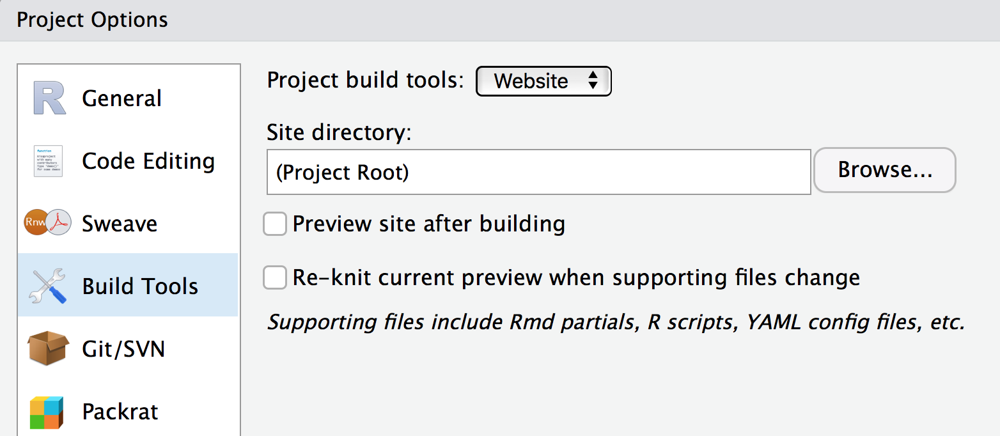

---

# Updated RStudio Project Templates

https://blog.rstudio.com/2017/09/13/rstudio-v1.1---the-little-things/

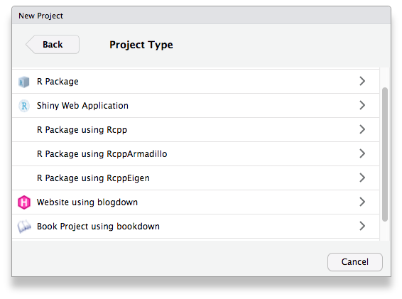

Note: you'll be able to install Hugo automatically if you use this method.


---

# Build your site

- Default theme (*we will work with this tonight*)

```{r}
blogdown::new_site() 
```

--

- Different theme

```{r}
blogdown::new_site(theme = "gcushen/hugo-academic", 
                   theme_example = TRUE)
```

--

- Change your mind
    
```{r}
blogdown::install_theme("gcushen/hugo-academic", 
                        theme_example = TRUE, 
                        update_config = TRUE)
```

---

class: inverse, middle, center

# Explore your site


---

# Hello Hugo

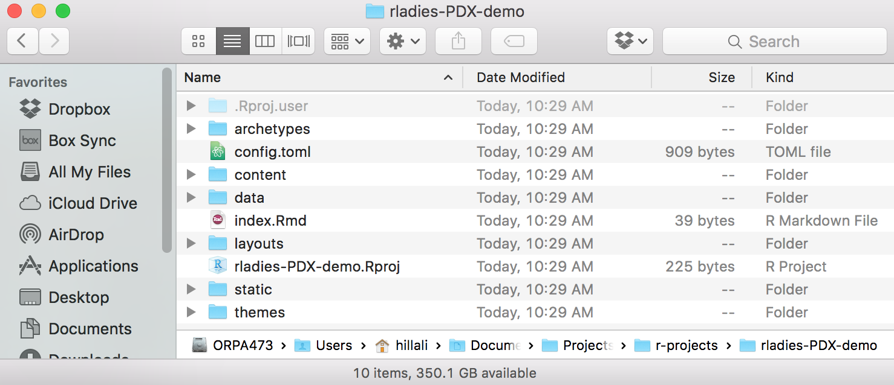

---

# Hugo Directory Structure

https://gohugo.io/getting-started/directory-structure/

Know your way around:

```{r}
.
├── archetypes
├── config.toml
├── content
├── data
├── layouts
├── public
├── static
└── themes
```


---

# Directory names

* Trailing slash will indicate a directory name, e.g., `content/` means a directory named content instead of a file named content.

```{r}
.
├── archetypes
├── config.toml
{{├── content}}
|   └── posts
├── data
├── layouts
├── public
├── static
└── themes
```

---

# File names

* Leading slash in a path indicates the root directory of the website, e.g., `/static/css/style.css` means the file `static/css/style.css` under the root directory of your website project instead of your operating system.

```{r}
.
├── archetypes
├── config.toml
├── content 
├── data
├── layouts
├── public
├── static
|   └──  css
{{|        └──  style.css}}
└── themes
```


---

# Overriding vs editing

https://gohugo.io/themes/customizing/

> *When you use a theme cloned from its git repository, do not edit the theme’s files directly. Instead, theme customization in Hugo is a matter of overriding the templates made available to you in a theme. This provides the added flexibility of tweaking a theme to meet your needs while staying current with a theme’s upstream.*

--

Note which folders are *empty* at the top level of your project:

```{r}
.
{{├── archetypes}}
├── config.toml
├── content
{{├── data}}
{{├── layouts}}
├── public
{{├── static}}
└── themes
```


---

# Serve site

- Console
```{r}
blogdown::serve_site()
```

--

- or RStudio Addin (*recommended*)

---

# LiveReLoad

https://bookdown.org/yihui/blogdown/a-quick-example.html

1. Edit + save triggers

--

1. Blocks your console **by design**

--

1. Don't try to view in your *teeny tiny* RStudio viewer; click: `Show in new window`

---

class: inverse, middle, center

# Edit your site


---

class: inverse, middle, center

# Edit your site


## <i class="fa fa-pencil" aria-hidden="true"></i>&nbsp; Edit 1: add a logo


---

class: inverse, middle, center

# Edit your site

Starting now, the numbers of each file will correspond to which edit we are working on. 

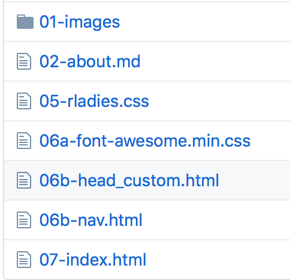

---


# Edit 1: add a logo

The logo file belongs in the `/static/` directory:

> *`/static/` stores all the static content for your future website: images, CSS, JavaScript, etc. When Hugo builds your site, all assets inside your static directory are copied over as-is.*

https://gohugo.io/getting-started/directory-structure/

--

1. Move `01-images` folder to `/static/`

--

1. Rename folder `images` (so now you have a `static/images/` folder with 2 .png files in it)

--

1. Update `config.toml` and save

```{r}
  [params.logo]
    {{url = "rladies-r-logo.png" }}
    width = 50
    height = 50
    alt = "Logo"
```


---

class: center

# Edit 1: did we add a logo?

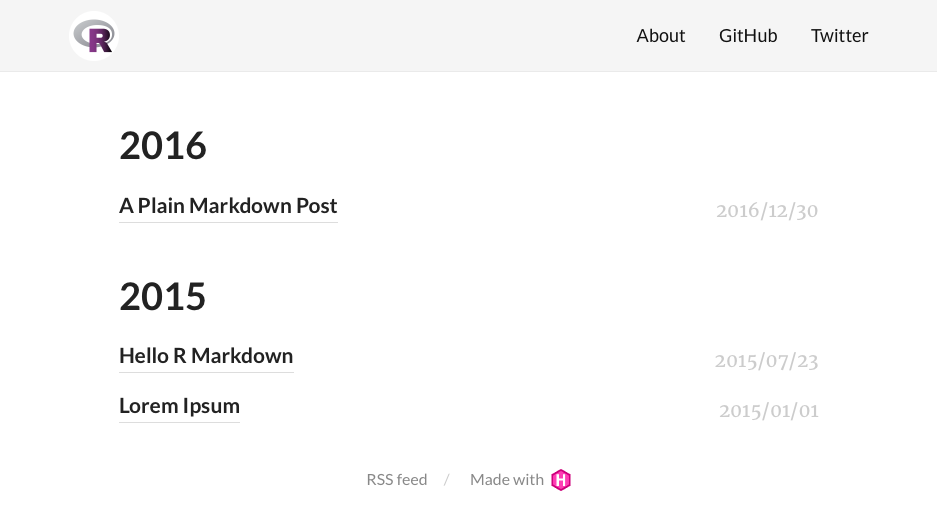

---

# Edit 1: did we learn something?

Yes!

--

We saw:

`/themes/<THEME>/static/images/logo.png`

--

Could be overwritten by:

`/static/images/<rladies-r-logo.png>`

--

The filename `<rladies-r-logo.png>` could have been anything, because there is a place to specify the url in the `config.toml` file

> *This only works for templates that Hugo “knows about” (i.e., that follow its convention for folder structure and naming). If a theme imports template files in a creatively named directory, Hugo won’t know to look for the local /layouts first.*

https://gohugo.io/themes/customizing/

---

class: inverse, middle, center

# Edit your site


## <i class="fa fa-pencil" aria-hidden="true"></i>&nbsp;Edit 2: update the "About" page

---

# Edit 2: update the "About" page

1. Move `02-about.md` file to `/content/`

--

1. Delete the existing file `about.md`

--

1. Rename `02-about.md` --> `about.md` <sup>1<sup>


.footnote[
[1] you should still have *LiveReLoad* running...
]

---

class: center

# Edit 2: did we change the about page?

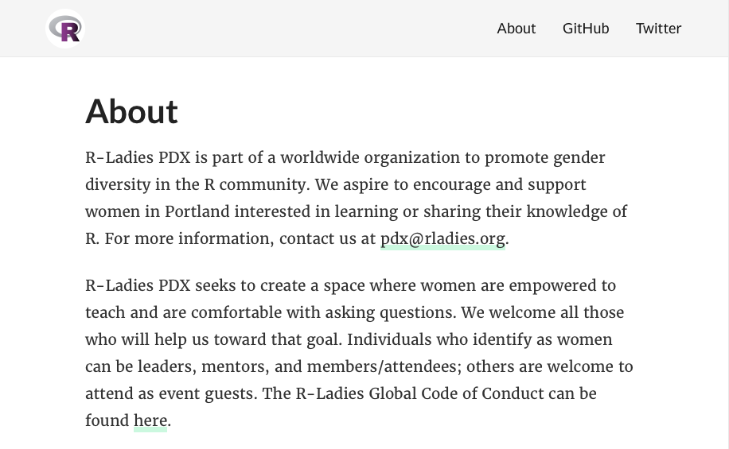

---

# Edit 2: did we learn something?

Yes!

> *`/content/` stores all content for your website... Each top-level folder in Hugo is considered a content section. For example, if your site has two main sections—blog posts and your about page— you will have 1 directory at `content/post/` and 1 file `content/about.md`.* 

https://gohugo.io/getting-started/directory-structure/

--

```{r}
.
├── archetypes
├── config.toml
├── content
{{|   └──  post <<- path: `baseurl/post/` }}
{{|   └──  about.md <<- path: `baseurl/about/`}}
├── data
├── layouts
├── public
├── static
└── themes
```


---

class: inverse, middle, center

# Edit your site


## <i class="fa fa-pencil" aria-hidden="true"></i>&nbsp;Edit 3: emojis 🙈🙉🙊

---

# Edit 3: enable emojis

- Top of your `config.toml` file

--

- Note the last line 😉

```{r}
baseurl = "/"
languageCode = "en-us"
{{title = "R-Ladies PDX" }}
theme = "hugo-lithium-theme"
googleAnalytics = ""
disqusShortname = ""
ignoreFiles = ["\\.Rmd$", "\\.Rmarkdown$", "_files$", "_cache$"]
{{enableEmoji = true }}
```


--

- In your "About" page, :heart: should now be ❤️

---

# Edit 3: did we learn something?

Yes!

> *Often the default settings are good enough, but the config file can provide highly granular control over how your site is rendered.*

https://gohugo.io/getting-started/configuration/

Go to the **All Variables, TOML** section for the full list

--

Note that the values nested under `[params]` will populate the `.Site.Params` variable for use in templates (more on this later)

---

class: inverse, middle, center

# Edit your site


## <i class="fa fa-pencil" aria-hidden="true"></i>&nbsp;Edit 4: change the navigation bar

---

# Edit 4: change the navigation bar

In your `config.toml` file:

```{r}
[[menu.main]]
    name = "About"
    url = "/about/"
{{  weight = 1}}
[[menu.main]]
{{  name = "Meetups"}}
{{  url = "https://www.meetup.com/R-Ladies-PDX/"}}
{{  weight = 2}}
[[menu.main]]
    name = "Twitter"
{{  url = "https://twitter.com/RLadiesPDX"}}
{{  weight = 3}}
```


---

class: center

# Edit 4: did we change the navigation bar + links?


---

# Edit 4: did we learn something?

Yes!

The `[[menu.main]]` in your `config` file is special:

> *A menu entry in a menu template has specific variables and functions to make menu management easier.*

https://gohugo.io/variables/menus/

---

class: inverse, middle, center

# Edit your site


## <i class="fa fa-pencil" aria-hidden="true"></i>&nbsp;Edit 5: colors, fonts, styles

---

# Edit 5: customize CSS

1. In `/static/` create a new directory `css`

--

1. Move `05-rladies.css` file to `/static/css/`

--

1. Rename `05-rladies.css` --> `rladies.css`

--

1. In `config.toml`, add last line: <sup>1</sup>

```{r}
[params]
   description = "A website built through Hugo and blogdown."
{{  customCSS = ["css/rladies.css"]}}
```


.footnote[
[1] how did I know the name of this parameter? 🕵🏽
/themes/<THEME>/layouts/partials/head.html
]

---

class: center

# Edit 5: did we change the CSS?

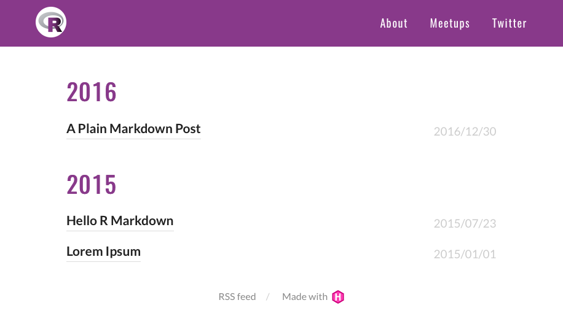

---

# Edit 5: did we learn something?

Yes!

--

We saw:

`/themes/<THEME>/static/css/main.css`

--

Could be overwritten by style rules present in:

`/static/<css/rladies.css>`

--

The directory/filename `<css/rladies.css>` could have been anything, because there is a place to specify the url in the `config.toml` file

---

class: inverse, middle, center

# Edit your site


## <i class="fa fa-pencil" aria-hidden="true"></i>&nbsp;Edit 6: add awesome icons

<i class="fa fa-bath fa-3x" aria-hidden="true"></i>&nbsp;
<i class="fa fa-bicycle fa-3x" aria-hidden="true"></i>&nbsp;
<i class="fa fa-paper-plane fa-3x" aria-hidden="true"></i>&nbsp;
<i class="fa fa-camera-retro fa-3x" aria-hidden="true"></i>

---

# Edit 6: add awesome icons

About [Font Awesome](http://fontawesome.io):

> Font Awesome gives you scalable vector icons that can instantly be customized — size, color, drop shadow, and anything that can be done with the power of CSS.

--

Go [here](http://fontawesome.io/get-started/) to enter your email address and receive a Font Awesome embed code. We'll use mine for demo tonight.

--

To use them, you need 2 things: 

1. the Font Awesome CSS file (where should this go?), and 
1. a script that directs your site to where the fonts can be found (via Font Awesome's Content Delivery Network, or CDN)


---

# Edit 6: add awesome icons

You know the drill now- always remove my numbers, `##-`, that are prepended to filename

1. Move `font-awesome.min.css` to `/static/css/`

--

1. Create a new directory in `layouts/` called `partials`

--

1. Move other `head_custom.html` and `nav.html` to `/layouts/partials/` 
  - Why? Let's open them up and take a look

--

Note that you can [use the icons anywhere](http://fontawesome.io/examples/), for example, you could add them to your About page:

`For more information, contact us at <i class="fa fa-envelope-open" aria-hidden="true"></i><mailto:pdx@rladies.org>.`

For more information, contact us at <i class="fa fa-envelope-open" aria-hidden="true"></i>&nbsp;<mailto:pdx@rladies.org>.

---

# Edit 6: final steps to add icons

Make changes to these sections in your `config.toml`:

```{r}
[[menu.main]]
    name = "About"
{{   pre = ""}} 
    url = "/about/"
    weight = 1
[[menu.main]]
    name = "Meetups"
{{   pre = "fa-meetup"}} 
    url = "https://www.meetup.com/R-Ladies-PDX/"
    weight = 2
[[menu.main]]
    name = "Twitter"
{{   pre = "fa-twitter"}}
    url = "https://twitter.com/RLadiesPDX"
    weight = 3
    
[params]
    description = "A website built through Hugo and blogdown."
{{   customCSS = ["css/rladies.css", "css/font-awesome.min.css"]}}
```

---

class: center

# Edit 6: are there awesome icons?

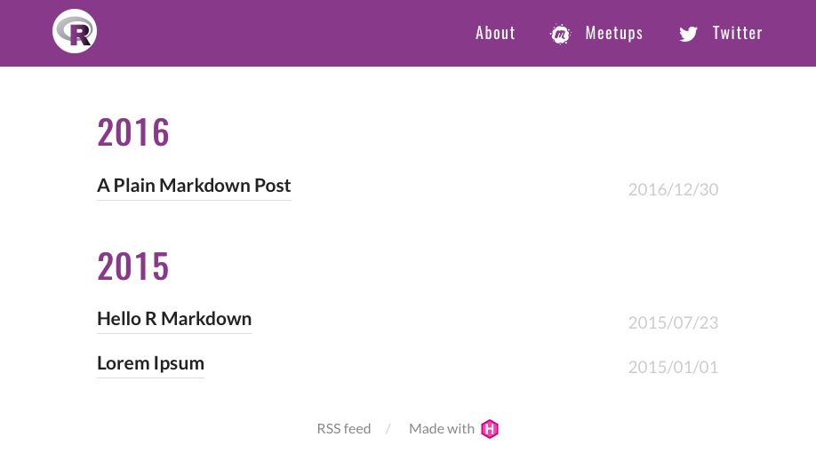

---

# Edit 6: did we learn something?

...

--

Yes!

We saw:

`/themes/<THEME>/layouts/partials/*<PARTIALNAME>.html`

--

Could be overwritten by:

`/layouts/partials/*<PARTIALNAME>.html`

--

The `<PARTIALNAME>`s **must** match; unless you want to edit how the partials are called within your templates:


```{r}
{{ {{ partial "<PATH>/<PARTIAL>.html" . }} }}
```

https://gohugo.io/templates/partials/

---

class: inverse, middle, center

# Edit your site


## <i class="fa fa-pencil" aria-hidden="true"></i>&nbsp;Edit 7: make a homepage

---

# Edit #7: Hugo homepages

https://gohugo.io/templates/homepage/

The lookup order for the homepage template is as follows:

```
/layouts/index.html
/layouts/_default/list.html
/themes/<THEME>/layouts/index.html
/themes/<THEME>/layouts/_default/list.html
```

--

Which file on our site is currently serving as the homepage template?

---

# Edit 7: make a homepage


- Where should we move the file `index.html`?

--

- Move `index.html` --> `/layouts/` <sup>1</sup>


.footnote[
[1] NOT to /layouts/partials/
]

---

# Edit 7: edit the homepage

Edit the `config.toml` file

```{r}
[params]
{{  description = "R-Ladies PDX is part of a world-wide organization 
    to promote gender diversity in the R community. <br>
    To find more details about the R-Ladies global initiative, 
    visit [rladies.org](https://rladies.org)."}}
{{  chapter = "Portland, Oregon"}}
   customCSS = ["css/rladies.css", "css/font-awesome.min.css"] 
```

--

Note that the chapter parameter is *new*. Now, this is a variable that can be referenced in templates as:

`{{ .Site.Params.Chapter }}`


---

class: center

# Edit 7: do we have a new homepage?

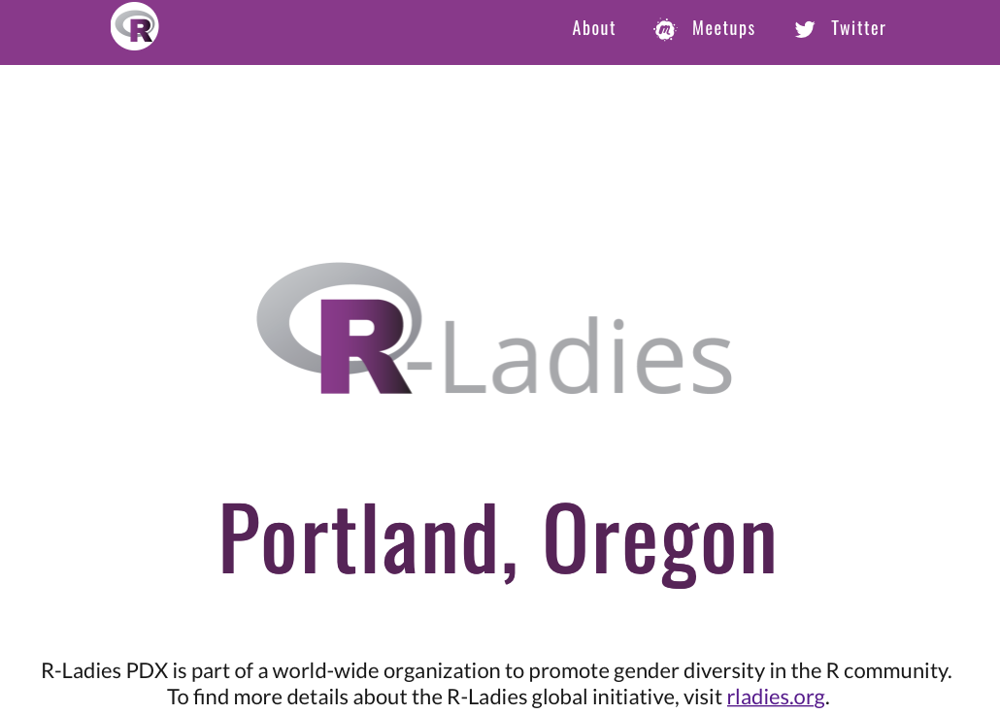

---

# Edit 7: did we learn something?


Yes!

We saw that, even when there is no file here:

`/themes/<THEME>/layouts/index.html`

--

We can make one here that serves as the homepage:

`/layouts/index.html`

--

The filename `index.html` has special status in Hugo, and is **not** a partial layout template.

You *could* also force a homepage by creating an `_index.md` file that lives at the root of your `/content/` folder (i.e., `/content/_index.md`)

https://gohugo.io/templates/homepage/


---

class: inverse, middle, center

# Edit your site


## <i class="fa fa-pencil" aria-hidden="true"></i>&nbsp;Edit 8: hey wait! where are my posts?

---

# Edit 8: hey wait! where are my posts?

How can we get them back? Ideas?

--

Try adding this in the `config.toml` file: 

```{toml}
[[menu.main]]
    name = "Twitter"
    pre = "fa-twitter"
    url = "https://twitter.com/RLadiesPDX"
    weight = 3
{{[[menu.main]]}}
{{   name = "News"}}
{{   pre = "fa-bullhorn"}}
{{   url = "/post/"}}
{{   weight = 4}}
```

---

class: center

# Edit 8: do we have news?

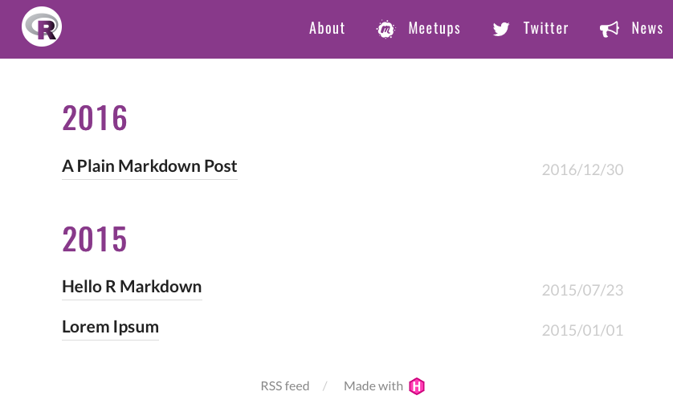

---

# Edit 8: did we learn something?

Yes!

--

> *While Hugo supports content nested at any level, the top levels (i.e. `/content/<DIRECTORIES>`) are special in Hugo*

https://gohugo.io/content-management/organization/

--

Without any additional configuration, the following will just work:

```{r}
.
└── content
    └── post
        ├── firstpost.md   <<- https://example.com/post/firstpost/
        └── happy
            └── ness.md  <<- https://example.com/post/happy/ness/
```


---

class: inverse, middle, center

# Deploy your site


---

# Deployment

* The publishing directory is by default `/public/`. 

--

* Each time you serve your site locally, Hugo will generate your website to `/public/`.

--

* You can upload everything under `/public/` to any web server that can serve static websites, and your website will be up and running.

--

* You could also use a *continuous deployment service*. When linked to a git repository, any git push triggers an automatic fresh deployment.

https://gohugo.io/hosting-and-deployment/hosting-on-netlify/

--

* If using continuous deloyment, you'll need a .gitignore file, and you will need to add `public/` to your list of files for git to ignore

---

# I recommend Netlify

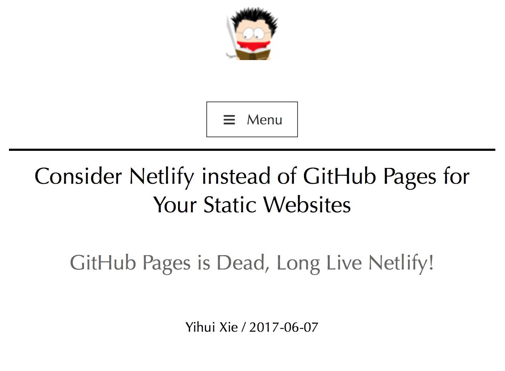

---

class: inverse, middle, center

# How to git from the start

https://apreshill.rbind.io/post/up-and-running-with-blogdown/

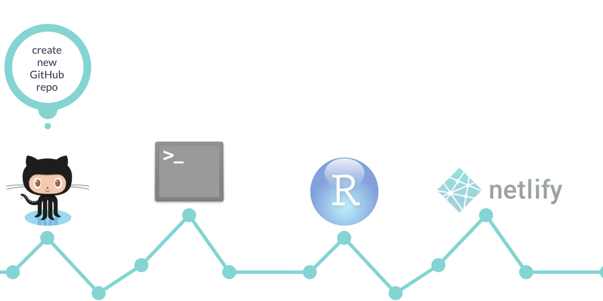

---

class: inverse, middle, center

# How to git at the end

http://happygitwithr.com/existing-github-last.html

---

# Netlify deploy settings

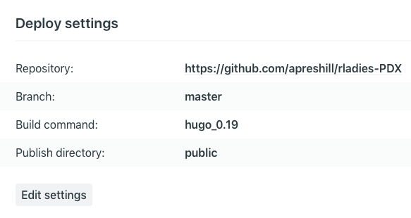

---

# Netlify site name

This was the original site name: `shepherd-brushes-37154`

On [Netlify](https://www.netlify.com), go into `General -> Site details -> Site information -> Change site name` and update

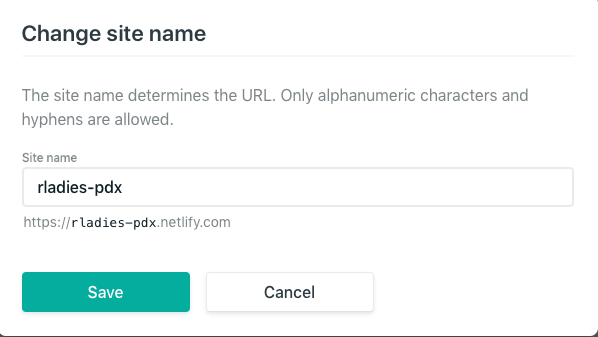

---

# rbind subdomains

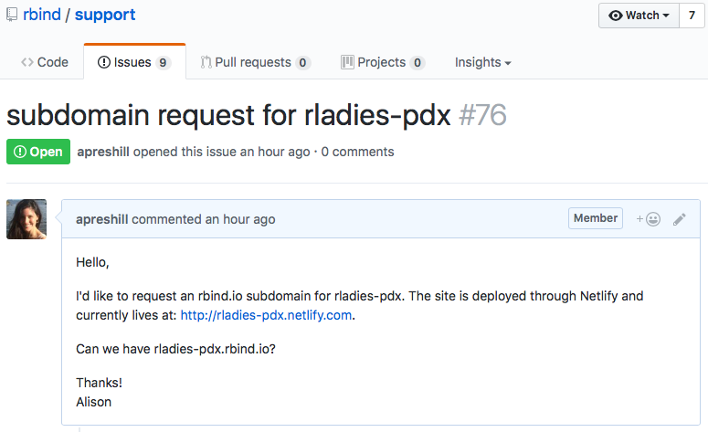

---

# Final edit: update baseurl

Top of your `config.toml`

```toml
baseurl = "https://rladies-pdx.rbind.io/"
```

On [Netlify](https://www.netlify.com), go into `Domain settings -> Custom domain` and update

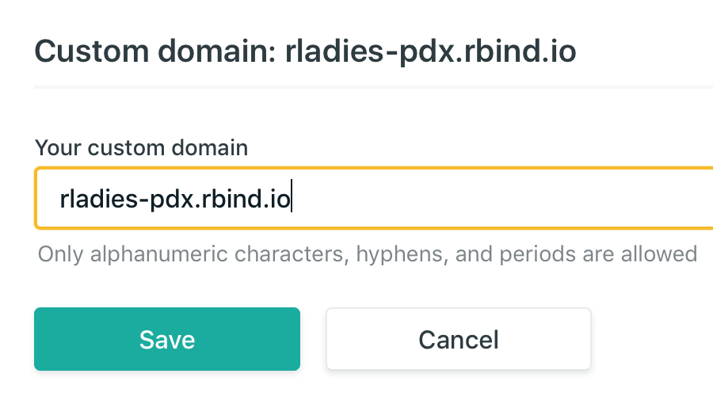

---

class: center, middle

# More resources

A minimal website example using **blogdown**
Site: https://blogdown-demo.netlify.com
GitHub: https://github.com/apreshill/blogdown-demo

Includes using citations in posts, including Rmd files of other output formats, and embedding htmlwidgets in posts

View the actual demo site:
https://rladies-pdx.netlify.com

More on posting here:
https://apreshill.rbind.io/post/up-and-running-with-blogdown/#build-your-site-in-rstudio

And here:
https://bookdown.org/yihui/blogdown/output-format.html

---

class: center, middle

# Thanks!

To Yihui and RStudio for the [**blogdown** package](https://cran.r-project.org/web/packages/blogdown/index.html)

To Yihui and Amber for inviting me to be a co-author on the [**blogdown** book](https://bookdown.org/yihui/blogdown/)

To the [`rbind`](https://github.com/rbind) group for awesome support

To the R-Ladies PDX organizers, Augustina and Deeksha, for allowing me to use them as a guinea pig- join the [R-Ladies PDX meetup group](https://www.meetup.com/R-Ladies-PDX/)!

Slides created via the R package [**xaringan**](https://github.com/yihui/xaringan).
